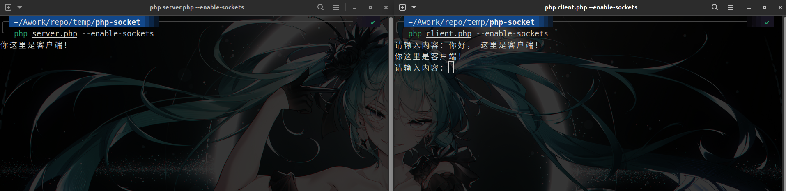
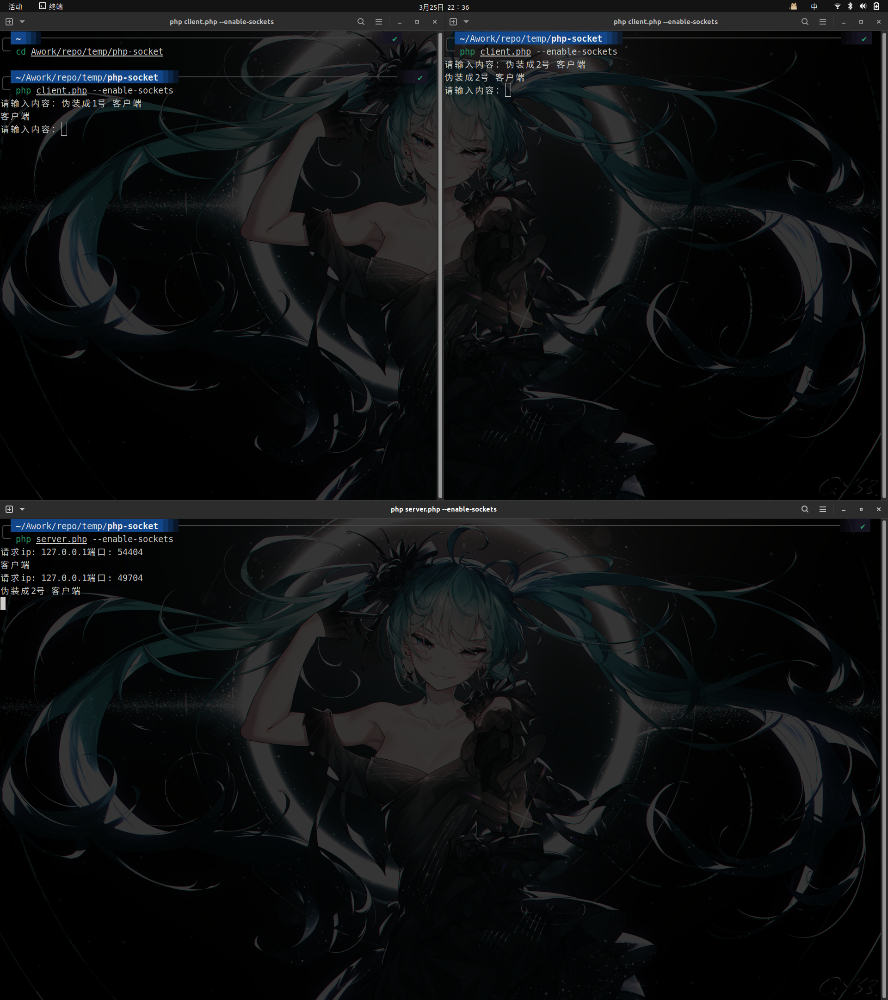

# PHP&Vue实现线上聊天室

## php

### php原生socket实现客户端和服务端数据传输

#### socket

> Socket是一种计算机网络通信的技术，它允许不同计算机之间通过互联网或本地网络建立通信连接。在计算机通信中，socket是一个抽象层，它为应用程序提供了一个独立于底层网络协议的编程接口。Socket是由一个网络地址和一个端口号组成的，通常使用TCP或UDP协议进行数据传输。其中TCP是一种可靠的流协议，它提供了面向连接、可靠的、基于字节流的传输服务；UDP是一种无连接的协议，它提供了不可靠的、无序的、基于数据报的传输服务。
>
> Socket可以被视为两个计算机之间通信的电话插孔。就像在电话插座插入插头以建立通信一样，计算机程序使用Socket来建立网络连接，以便在两个计算机之间传输数据。就像两个电话插孔可以进行多次通话，同样的套接字可以接受多个连接并进行数据交换。然而，连接必须始终由一方打开并由另外一方接受。这些套接字可以看作是计算机进行通信的接口，就像电话插孔是通信的接口一样。同样地，套接字被指定为IP地址和端口号的组合。在通信期间，数据流通过套接字与计算机之间传输，就像两个人之间的语音信号通过电话线传输一样。

> [参考文章👈](https://www.codeover.cn/php-socket/)
>
> socket 链接的三个过程
>
> 1. 服务端监听：IP+端口号
> 2. 客户端请求：发出向服务端的 IP 以及端口的连接请求
> 3. 链接确认：服务端套接字监听到或者说接收到客户端套接字连接请求，他就会建立一个新的进程，把服务端的套接字描述发给客户端，以响应客户端的请求，一旦客户端确认了此描述，连接就建立好了。儿服务端的套接字继续处于监听状态，继续接受其他客户端套接字的连接请求。

#### 阻塞

> 在计算机编程中，"阻塞"（Blocking）指的是一个线程的执行被暂停，直到某个条件得到满足。在服务器端等待客户端连接时，该进程会一直停留在接收连接的代码行，并一直等待新的连接到来，这个过程是阻塞状态。在此期间，该进程不会执行其它任务，直到有新的连接请求到来然后才能继续执行。换句话说，阻塞表示某个代码行未执行完毕，程序会停止在该行继续等待，直到指定的条件满足，才会继续往下执行。这种阻塞模型通常会导致服务器响应速度较慢，因为当一个连接进来时，要等待连接建立后才能继续执行之后的逻辑。

#### `index.php`是如何运行的

> 当你执行 `php index.php` 命令时，操作系统会启动 PHP 解释器，并将 `index.php` 文件作为输入源文件来解析执行其中的 PHP 代码。
>
> 下面是一个 PHP 文件从解析到执行的过程：
>
> 1. PHP 解释器会首先进行语法分析，检查 `index.php` 文件中的 PHP 代码是否符合语言规范。如果代码存在语法错误，则解释器会在控制台输出相关错误信息。
> 2. 如果代码运行没有语法错误，解释器会开始解释执行。首先，PHP 解释器会根据你的源文件内容，生成一个 PHP 编译文件，这个操作是可选的，因为在第一次执行程序时，PHP也会在运行时即时编译和解释代码。但是，如果编辑器有修改代码细节，或者为了在多次执行代码时节省一些时间，可以选择显式地创建一个编译文件。创建的编译文件通常是二进制形式的，而不是原始的 PHP 代码。
> 3. 当编译完成后，PHP 解释器会按照编译文件中的指令，一条条地执行其中的 PHP 代码。执行过程中，解释器会将 PHP 文件中的变量进行解析，并在内存中分配空间存储它们的值。
> 4. 极有可能的情况是在PHP代码中包含了一些调用其他脚本或库的代码，解析器会根据 `include` 相关语法调用其他目标文件，并将它们的输出结果合并到当前脚本的输出中。
> 5. 当脚本运行完成后，解释器会将程序执行的结果输出到标准输出设备（通常是终端屏幕）上，这样你就可以看到脚本返回的结果了。

> PHP的编译过程可以分为以下几个步骤：
>
> 1. 词法分析
>
> PHP源代码首先会经过词法分析器进行处理，将代码切割成一个个的词法单元，例如关键字、变量、函数、运算符等等。
>
> 2. 语法分析
>
> 接下来，PHP源代码将会被发送到语法分析器，也称为解析器，它会将词法单元生成为一个个的抽象语法树。在这个步骤中，解析器会检查代码是否符合PHP的语法规范，如果代码存在错误，解析器会给出解析错误的提示。
>
> 3. 生成中间代码
>
> 在PHP源代码通过语法分析器之后，它将被解释器转化为中间代码格式，这种格式是纯文本格式，程序会将其他格式的代码转化为它，例如PHP的源代码、asp、jsp等。中间代码格式能够使代码可移植性更加强。
>
> 4. 中间代码优化
>
> PHP支持的多种中间代码缓存机制，其中最流行的是Zend缓存。Zend缓存可以将PHP代码转换为计算机可执行的二进制代码，同时也可以进行一些代码的优化和缓存，以提高程序执行速度。
>
> 5. 二进制代码生成
>
> 如果这个PHP应用程序是一个WEB应用程序，当用户第一次请求时，PHP编译器会在服务器上生成一份运行的二进制代码，并直接执行它。如果在编译过程中出现了错误，例如语法错误或逻辑错误，编译过程会中断，并将错误消息输出到屏幕或写入日志文件中。

#### php实现socket

```php
// server.php
<?php

// 创建套接字
$socket = socket_create(AF_INET, SOCK_STREAM, SOL_TCP);

// 设置 ip 被释放后立即可使用
socket_set_option($socket, SOL_SOCKET, SO_REUSEADDR, true);

// 绑定ip与端口
socket_bind($socket, 0, 8888);

// 开始监听
socket_listen($socket);

while (true) {
    // 接收内容
    $conn_sock = socket_accept($socket);
    socket_getpeername($conn_sock, $ip, $port);
    // echo '请求ip: ' . $ip . PHP_EOL . '端口: ' . $port;

    while (true) {
        // 获取消息内容
        $msg = socket_read($conn_sock, 10240);
        // TODO 处理业务逻辑

        // 将信息转为大写并原样返回客户端
        socket_write($conn_sock, strtoupper($msg));

        echo $msg;
    }
}
```

```php
// client.php
<?php

// 创建套接字
$socket = socket_create(AF_INET, SOCK_STREAM, SOL_TCP);

// 连接服务端
socket_connect($socket, '127.0.0.1', 8888);

while (true) {
    // 让控制台输入内容
    fwrite(STDOUT, '请输入内容：');
    $in = fgets(STDIN);

    // 向服务端发送内容
    socket_write($socket, $in);

    // 读取服务端发送的消息
    $msg = socket_read($socket, 10240);
    echo $msg;
}
```

编译`php`时，添加`--enable-sockets`配置项启用socket。



#### 套接字

> 套接字是一种应用程序编程接口（API），用于允许应用程序在计算机网络上进行通信。它是通过网络进行通信的端点，通过在不同的计算机之间建立虚拟通道来发送和接收数据。套接字通常由一对IP地址和端口号定义，其中IP地址标识要连接的服务器或客户端的计算机，端口号标识要使用的协议和应用程序。在套接字编程中，开发人员可以创建自己的套接字来与网络通信，并发送和接收数据。套接字可以用于创建不同类型的网络应用，如网站服务器和在线视频聊天应用程序等。

#### 套接字资源

> 套接字资源是指在应用程序中创建和维护用于通信的套接字所需的系统资源。每个套接字都需要一定数量的资源，特别是在同时处理多个连接时，这些资源需求可能会变得相当高。
>
> 例如，一个服务器应用程序可能需要同时处理数百个连接请求。对于每个连接，它都需要创建一个套接字并分配一个唯一的端口号。每个套接字还需要分配和管理内存和其他系统资源，用于缓存和处理数据包，以便在通信时处理错误和超时等情况。在某些操作系统中，开发人员需要手动释放这些资源，以确保应用程序不会因为资源耗尽而崩溃或受到拒绝服务攻击。

#### IPC

> IPC是指进程间通信（Inter-Process Communication），是一种操作系统提供的机制，用于在同一台计算机上的不同进程之间进行通信和数据共享。进程是计算机操作系统中正在运行的程序，而IPC是这些程序之间传递消息和共享数据的方式。通过IPC，进程可以相互通信和协作，例如向另一个进程发送消息、共享资源和同步操作。
>
> IPC通常使用一些标准化方法来实现，如管道、消息队列、共享内存和信号量等。每种IPC方法都有其自身的优势和限制，使用时需要根据具体应用场景进行选择。例如，如果数据传输过程中需要保证数据不丢失，那么可以使用消息队列；如果需要高效的数据共享，则可以使用共享内存。
>
> IPC在操作系统中扮演着非常重要的角色，特别是在多任务和多进程应用程序中。例如在操作系统中，进程之间通过IPC进行通信，以便操作系统能够协调不同的任务和进程，从而使系统更高效地工作。

#### 监听

> “监听”（Listen）是指在计算机网络中，一台作为服务器的主机主动等待并接受来自其他计算机的连接请求的过程。当一台计算机作为服务器启动时，它会打开一个或多个“端口”监听连接请求。端口是计算机用于识别应用程序和网络服务的数字地址，常用的端口号例如80端口表示HTTP Web服务，22端口表示SSH远程连接等。
>
> 当该服务器主机开始监听端口时，它会不停地等待客户端计算机请求连接。当客户端有数据请求发送到该服务器对应的端口时，该服务器就会接收并处理这些请求，向客户端提供所需的服务，比如数据传输、Web页面等。这种服务端主动等待并接受来自客户端请求的连接的过程，就是“监听”。
>
> 在某些情况下，监听可以有多个目的。例如，它可以用于在网络中发现其他设备，或者用于监视数据流量以便检测网络攻击。无论哪种情况，监听的目的都是就是识别网络连接并处理来自其他计算机的请求。

### php原生socket之IO多路复用以及实现web服务器

#### IO

> IO是指Input/Output（输入/输出），是计算机与外部世界之间进行数据交换的方法。计算机通过输入设备（如键盘、鼠标等）接收数据，通过输出设备（如显示器、打印机等）输出数据。I/O操作是计算机中最基本、最重要也最频繁的操作之一。
>
> 以下是一些输入输出的例子：
>
> 1. 输入：当你在电脑上写字时，键盘输入的内容就是一种输入操作。
> 2. 输出：当你在电脑上查看网页或者打开某个软件时，电脑屏幕上显示的内容就是一种输出操作。
> 3. 读取文件：当你在电脑上打开某个文件时，计算机会从硬盘上读取这个文件，这也是一种输入操作。
> 4. 写入文件：当你在电脑上保存某个文件时，计算机会将文件内容写入硬盘，这也是一种输出操作。
> 5. 数据传输：当你使用USB盘或者网络向其他设备发送文件时，就是一种输出操作；而当你从USB盘或者网络接收文件时，就是一种输入操作。

#### IO多路复用机制

> IO多路复用机制是指在一个进程中，可以同时监控多个输入输出流（如网络套接字、文件描述符等）的机制。通过这种机制，一个进程可以同时处理多个输入输出请求，从而大大提高了系统的并发处理能力。通常使用select、poll、Epoll等系统调用实现。
>
> 在传统的阻塞式I/O模型中，一个进程只能处理一个文件描述符（socket）的I/O请求，如果在等待I/O完成期间阻塞，系统会挂起整个进程，直到I/O完成。而在使用IO多路复用机制时，可以通过系统调用同时监控多个文件描述符，如果某个文件描述符有I/O请求，进程就会被唤醒，进行处理，从而实现了对多个I/O请求的并发处理，提高了系统的效率和吞吐量。

#### php原生socket实现IO多路复用机制实战

```php
// server.php
//与上文相比进行了些许变动，client.php未改动
<?php

// 创建套接字
$socket = socket_create(AF_INET, SOCK_STREAM, SOL_TCP);

// 设置 ip 被释放后立即可使用
socket_set_option($socket, SOL_SOCKET, SO_REUSEADDR, true);

// 绑定ip与端口
socket_bind($socket, 0, 8888);

// 开始监听
socket_listen($socket);

$sockets[] = $socket;

while (true) {
    $tmp_sockets = $sockets;
    socket_select($tmp_sockets, $write, $except, null);

    foreach ($tmp_sockets as $sock) {
        // 如果当前套接字等于 socket_create 创建的套接字，说明是有新的连接或有新的断开连接
        if ($sock == $socket) {
            $conn_sock = socket_accept($socket);
            $sockets[] = $conn_sock;
            socket_getpeername($conn_sock, $ip, $port);
            echo '请求ip: ' . $ip . '端口: ' . $port . PHP_EOL;
        } else { // 否则说明是之前连接的客户端发来消息
            $msg = socket_read($sock, 10240);
            socket_write($sock, strtoupper($msg));
            echo $msg;
        }
    }
}
```

演示画面



#### HTTP协议

> HTTP（Hypertext Transfer Protocol，超文本传输协议），是一种用于传输超媒体文档（例如HTML）的应用层协议，它是一个客户端-服务端协议，也就是说，请求从客户端发送到服务器端，服务器端做出响应并发送回客户端。
>
> HTTP协议定义了客户端和服务器端之间交互的规范，规定了客户端和服务器端的请求格式、响应格式、状态码以及错误处理等细节，是互联网上常用的一种协议。
>
> HTTP协议使用TCP连接进行数据传输，端口号默认为80，但也可以使用其他端口。HTTP协议是一种无状态的协议，也就是说，每个请求都是独立的，服务器不会记住之前的请求状态，需要客户端在每个请求中提供必要的信息。为了解决这个问题，HTTP引入了Cookie和Session技术。
>
> HTTP支持许多不同的请求类型（如GET、POST、PUT、DELETE等），可以与各种Web服务器和应用程序交互，常见的应用场景包括浏览器访问网页、API接口调用、文件上传和下载等。

#### HTTP协议 & Socket

> HTTP协议是应用层协议，而Socket是底层网络通信的API，HTTP协议和Socket是不同抽象层次中的概念。
>
> HTTP协议在进行客户端和服务器端之间的通信时，需要使用Socket来进行底层的数据传输，因此它们是互相依存的。客户端通过Socket向服务器发出HTTP请求，服务器收到请求后进行处理并通过Socket向客户端发送HTTP响应，这是HTTP协议和Socket之间的基本交互方式。
>
> 在实际应用中，我们通常使用HTTP客户端库（如Python中的Requests库、Java中的HttpClient库）来处理HTTP请求和响应，这些库已经在内部实现了Socket通信，从而屏蔽了底层通信细节，方便了开发人员的使用。但如果需要更底层的网络通信控制，还是需要使用Socket进行底层编程。总之，HTTP协议和Socket在Web应用程序的开发中密不可分，它们是实现Web操作和网络传输的重要基础。

#### php原生socket实现简易http服务器

```php
// server.php
<?php

// 创建套接字
$socket = socket_create(AF_INET, SOCK_STREAM, SOL_TCP);

// 设置 ip 被释放后立即可使用
socket_set_option($socket, SOL_SOCKET, SO_REUSEADDR, true);

// 绑定ip与端口
socket_bind($socket, 0, 8888);

// 开始监听
socket_listen($socket);

$sockets[] = $socket;

while (true) {
    $tmp_sockets = $sockets;
    socket_select($tmp_sockets, $write, $except, null);

    foreach ($tmp_sockets as $sock) {
        if ($sock == $socket) {
            $conn_sock = socket_accept($socket);
            $sockets[] = $conn_sock;
        } else {
            $msg = socket_read($sock, 10240);
            var_dump($msg);
            if ($msg == '') return;
            
            $output = '<h1>this is php worker</h1>';
            $len = strlen($output);
            
            $response = "HTTP/1.1 200 OK\r\n";
            $response .= "content-type: text/html\r\n";
            $response .= "server: php socket\r\n";
            $response .= "Content-Length: {$len}\r\n\r\n";
            
            $response .= $output;

            socket_write($sock, $response);
        }
    }
}
```

### php原生socket实现websocket聊天室

#### websocket

> WebSocket 是一种先进的网络技术，它提供了在单个 TCP 连接上进行双向通信的功能，允许浏览器和服务端保持实时通信。传统的 HTTP 连接仅仅支持客户端向服务器端发送请求，并获取服务器端的响应，但是无法支持服务器端向客户端主动推送更新的数据。这就是 WebSocket 的作用，可以建立双向的数据通路。
>
> WebSocket 与 HTTP 的区别在于，WebSocket 是一种真正的双向通信协议，它使得服务端与客户端能够真正地直接对话，从而可以避免不必要的数据传输，降低网络延迟。
>
> 在 WebSocket 中，服务端和客户端通过建立一个长连接来实现，一旦连接建立，它们就可以自由地发送和接收数据，而不用建立多次连接。这意味着 WebSocket 不仅可以实现较低的延迟和较少的网络流量，还可以提供更高效和实时的通讯，适用于各种 web 应用的场景，例如游戏、在线聊天、在线编辑、实时数据报告等等。
>
> 此外，与 HTTPS 相比，WebSocket 在网络开销方面更低，因为它文本格式数据解析能力更强，在处理大量数据时更加高效。而且 WebSocket 协议可与现有的 HTTP 和 HTTPS 端口80和443共享，因此几乎不需要特殊设置就可以使用它。

#### TCP 的慢启动特性

> TCP的慢启动特性是一种用来预防网络拥塞的机制。当一个 TCP 连接开始时，发送方会发送一个或多个较小的数据包，此时发送方并不知道网络的最大带宽或拥塞程度。因此，慢启动的目标是探测网络的最大带宽，从而逐步增加数据包的发送速率。
>
> 在慢启动期间，TCP发送方按指数级递增的速率发送数据包，直到它觉得网络出现拥塞的迹象。如果出现丢包的情况，TCP 就认为到达了网络的容量极限，此时它就开始将发送速率以线性递减的方式降下来。这样做有助于避免网络拥塞，以便更多的流量可以通过。
>
> 因此，TCP慢启动特性的目的是通过逐步增加发送速率来探测网络的最大带宽，并在出现拥塞的情况下减少发送速率，以避免网络拥塞并优化网络带宽的利用率。

#### websocket握手

> "WebSocket协议在连接前需要握手"是指在客户端和服务器进行WebSocket一对一通信之前，需要先进行一次特殊的协议握手。
>
> 这个握手过程包括以下步骤：
>
> 1. 客户端发起WebSocket请求，向服务器发起一个http请求，请求中包含一个Upgrade头部，其值为websocket，此外还有Connection头部，其值为Upgrade。
> 2. 服务器返回一个包含Upgrade和Connection头部的http响应，告诉客户端请求已经被接受，可以进行WebSocket通信。服务器的响应还包含Sec-WebSocket-Accept头部，该头部的值是根据客户端请求中的Sec-WebSocket-Key计算出来的。
> 3. 握手成功后，客户端和服务器之间的通信就可以采用WebSocket协议进行，可发送和接收双向的数据帧。
>
> 握手过程的目的是确保客户端和服务器都支持WebSocket协议，并且可以通过约定好的算法进行连接。因此，在WebSocket进行通信之前，都必须经过这个握手过程。
>
> 当前主要的握手协议是基于 sha1 加密方式的握手协议，其它还包括基于flash和基于md5加密方式的握手协议。

#### sha-1 加密算法

> SHA-1是安全哈希算法1的缩写，也称为SHA，它是一种哈希算法，用于对信息进行安全性相关的处理和验证。
>
> 哈希算法将任意长度的消息压缩成一串固定长度的输出值，这个输出值通常称为哈希值或消息摘要。SHA-1将消息处理为一个160位的哈希值，并用此哈希值对消息进行验证。对于相同的输入消息，其输出哈希值是唯一且不变的，因此可以用于确保数据的完整性和非重复性。
>
> SHA-1适用于数字签名标准，并被广泛用于数字证书、SSL/TLS通信协议以及其他网络安全协议中。SHA-1最初由美国国家标准与技术研究所(NIST)发布，在2002年之前被认为是安全的，但是随着时间的推移，SHA-1的安全性逐渐被破解，目前已经被强烈建议不再使用。
>
> SHA-1在计算上比较简单，但它的安全性已经不足以满足现代网络的安全需求。替代的哈希算法，如SHA-2或SHA-3已经被广泛采用，以提供更高的安全性保护。

#### php实现WebSocket客户端与服务端握手

```php
// server.php

<?php

$socket = socket_create(AF_INET, SOCK_STREAM, SOL_TCP);
socket_set_option($socket, SOL_SOCKET, SO_REUSEADDR, true);
socket_bind($socket, 0, 8888);
socket_listen($socket);

while (true) {
    $conn_sock = socket_accept($socket);
    $request = socket_read($conn_sock, 102400);

    $new_key = getShaKey($request);

    $response = "HTTP/1.1 101 Switching Protocols\r\n";
    $response .= "Upgrade: websocket\r\n";
    $response .= "Sec-WebSocket-Version: 13\r\n";
    $response .= "Connection: Upgrade\r\n";
    $response .= "Sec-WebSocket-Accept: {$new_key}\r\n\r\n";

    socket_write($conn_sock, $response);
}

function getShaKey($request)
{
    // 获取 Sec-WebSocket-key
    preg_match("/Sec-WebSocket-Key: (.*)\r\n/", $request, $match);

    // 拼接 key + 258EAFA5-E914-47DA-95CA-C5AB0DC85B11
    $new_key = trim($match[1]) . '258EAFA5-E914-47DA-95CA-C5AB0DC85B11';

    // 对字符串做 `SHA1` 计算，再把得到的结果通过 `base64` 加密
    return base64_encode(sha1($new_key, true));
}
```

运行以上文件后，在浏览器控制台执行以下`js`指令

```javascript
console.log(new WebSocket('ws://127.0.0.1:8888'));
```

若返回的WebSocket对象的readyState值为1则成功。

```http
WebSocket {
    binaryType: "blob"
    bufferedAmount: 0
    extensions: ""
    onclose: null
    onerror: null
    onmessage: null
    onopen: null
    protocol: ""
    readyState: 1
    url: "ws://192.162.2.166:8888/"
}
```

#### OSI模型

> OSI（Open System Interconnection）模型是计算机网络通信协议的参考模型，由国际标准化组织（ISO）于1984年发布，是现代网络通信协议的基础。该模型定义了一种通用的网络协议架构，将计算机网络通信的各个方面分割成七个不同的抽象层次，便于在不同的系统中进行实现和交互操作。
>
> OSI模型的七层分别是：
>
> 1.物理层（Physical）： 确定如何在物理介质上传输原始数据比特流。
>
> 2.数据链路层（Data Link）： 为数据添加物理地址，以在物理网络上传输一个数据帧。
>
> 3.网络层（Network）： 负责在不同物理网络间转发数据包，实现不同网络之间的通信。
>
> 4.传输层（Transport）： 提供数据报文的可靠传输，为不同程序提供端到端的通信连接。
>
> 5.会话层（Session）： 构建和维护应用进程之间的通信会话，用于控制不同系统进程之间的同步和数据交换。
>
> 6.表示层（Presentation）： 定义数据的格式和表示，以确保为不同系统的应用程序提供标准的数据交换方式。
>
> 7.应用层（Application）： 围绕特定的应用程序提供服务，为最终用户的需求和兴趣提供用户接口和支持。
>
> OSI模型的每一层都有自己的专门功能和任务，不同层之间通过协议栈进行交互，以保持计算机网络系统的正常工作。

#### TCP

> TCP（Transmission Control Protocol）即传输控制协议，是一种常用的网络通信协议，位于 OSI 模型中的传输层。TCP协议是一种可靠的、面向连接的、基于流传输的协议。TCP 协议通过三次握手建立连接，使用滑动窗口和拥塞控制等技术保证数据的可靠传输。
>
> 在TCP连接建立后，发送方通过将待传输数据分成合适大小的数据段，并添加一些控制信息（如序列号、确认号和窗口大小等）封装成 TCP 包进行发送。接收方收到数据后，会对每个数据包进行确认回复，并且设置窗口大小，以控制发送方的数据传输速率，从而保证数据能够顺利、可靠地传输。
>
> 总的来说，TCP是一种保证数据可靠性，保证连续数据流的协议，常用于互联网上的数据传输，如网页浏览、在线视频、数据交换等。

#### 全双工通讯

> 全双工通讯指的是能够在一个数据通道上实现双向数据传输。在这个过程中，可以同时进行数据接收和数据发送而不需要切换工作模式或连接多个不同的数据通道。
>
> 对于网络通讯，传统的 HTTP 基于请求/响应模式工作，即浏览器向服务器发送请求并等待服务器响应。这种模式虽然能够满足很多需求，但是无法实现实时的数据更新或者交互。WebSocket 协议通过在单个 TCP 连接上实现全双工通讯，使得浏览器与服务器能够实时、双向通信，从而更适合于一些实时性的应用场景，如即时通讯、在线游戏等。
>
> 总的来说，全双工通讯提供了一种实现双向数据传输的方式，可以实现高效、实时、可靠的数据传输，而 WebSocket 协议则是一种实现全双工通讯的协议。

#### Ajax

> Ajax（Asynchronous JavaScript and XML）指的是一种基于 Web 技术，通过在客户端使用 JavaScript 和 XML 技术向服务器异步请求、获取数据和更新页面的技术。其主要优点在于，能够异步请求数据更新页面，而不需要刷新整个页面，从而带来更好的用户体验和更高的性能。此外，Ajax 还可以提高 Web 应用程序的交互性和可用性。
>
> 下面是 Ajax 技术的一些特点：
>
> 1. 异步通信： 使用 Ajax 请求过程是异步的，客户端可以继续响应用户的交互操作，而在后台请求数据。
> 2. 局部刷新： Ajax 技术可以只更新网页的部分内容，而不需要刷新整个页面，这种方式称为局部刷新或局部更新。
> 3. 减少服务器的负担： 使用Ajax 可以通过在客户端完成一些数据处理工作，从而减少服务器的负担，提升系统的性能。
> 4. 改善用户体验： 因为 Ajax 可以异步请求数据，因此可以在不影响用户体验的情况下更新页面，而且不需要用户手动刷新页面，提升用户体验。

####  Ajax 轮询

> Ajax轮询（Ajax Polling）是一种基于 Ajax 技术的 Web 应用程序实时更新数据的方式。其工作方式是在客户端向服务器发送周期性的请求，以检测服务器是否有新的数据需要更新，如果有则返回最新的数据。这个过程持续执行，直至终止轮询。
>
> 简单地说，Ajax轮询是一种在客户端定期向服务器发送 Ajax 请求以获取数据的方式。这个过程通常可以在后台不间断执行，从而实现 Web 应用程序的实时更新和数据推送。
>
> 与传统的轮询方式相比，Ajax轮询的优点在于只有在服务器有新数据的情况下才会返回数据，从而避免了不必要的网络请求和数据传输，减少了带宽浪费和服务器负担。同时，Ajax轮询也不需要对服务器进行任何配置或修改，因此对于 Web 应用程序的开发和部署更加方便。
>
> 但是，Ajax轮询的缺点在于，它仍然需要定期向服务器发送请求，这样可能会导致网络延迟、带宽浪费等问题。同时，服务器也需要不断地响应请求，从而增加了服务器负担。因此，需要权衡好使用 Ajax 轮询的频率和范围，避免对系统带来不必要的负担。

### php连接数据库

#### 未开启mysqli拓展

使用`phpinfo()`查看后发现没有这个拓展，那就手动安装。

```bash
sudo apt install php-mysqli
```

> 这里卡了好久，怎么连接数据库都报错，知道我想起来新系统我没装mysql ...

#### 连接数据库

```php
<?php
// 创建数据库连接
$servername = "localhost";
$username = "val";
$password = "val123!@#";
$dbname = "hello";

$conn = mysqli_connect($servername, $username, $password, $dbname);

// 检查连接是否成功
if (!$conn) {
  echo "Error";
} else {
  echo "OK";
  // 关闭连接
  mysqli_close($conn);
}
?>
```

### php实现上传、存储图片


<br>

---

## MySQL

前段时间重装了系统，忘记自己还没装数据库了，`php`怎么连接都报错，猛地想起了这个问题……

### 进入数据库

```bash
sudo mysql -u root -p
```

### 数据库密码初始化

```mysql
ALTER USER'root'@'localhost'IDENTIFIED BY 'your_password';
```

### 创建用户

```mysql
CREATE USER 'val'@'localhost' IDENTIFIED BY 'val123!@#';
```

### 创建库

```mysql
mysql> CREATE DATABASE hello;
Query OK, 1 row affected (0.01 sec)

mysql> GRANT ALL PRIVILEGES ON hello.* TO 'val'@'localhost';
Query OK, 0 rows affected (0.04 sec)
```

### 提交修改

```mysql
mysql> FLUSH PRIVILEGES;
Query OK, 0 rows affected (0.01 sec)
```


---

## JavaScript

### AJAX

> Ajax指异步JavaScript和XML（Asynchronous JavaScript and XML）, 是一种用于创建快速动态网页的技术。它使用JavaScript和XML等技术在不需要重新加载整个页面的情况下与服务器交换数据和更新部分网页内容。通过使用Ajax，用户可以获得更流畅、更快速的交互体验，因为只有需要更新的数据才会被重新加载。Ajax已经成为现代Web应用程序中的标准技术之一，并受到广泛应用。

### AJAX传递数据

> 以下是一个使用Ajax传递数据的例子：
>
> ```javascript
> <!DOCTYPE html>
> <html>
> <head>
> 	<title>Ajax Example</title>
> 	<script src="https://code.jquery.com/jquery-3.6.0.min.js"></script>
> 	<script>
> 		$(document).ready(function(){
> 			$("#submit-btn").click(function(){
> 				var name = $("#name").val();
> 				var email = $("#email").val();
> 				$.ajax({
> 					type: "POST",
> 					url: "submit.php",
> 					data: { name: name, email: email },
> 					success: function(response){
> 						alert(response);
> 					}
> 				});
> 			});
> 		});
> 	</script>
> </head>
> <body>
> 	<h2>Submit Form Using Ajax</h2>
> 	<label>Name:</label><br>
> 	<input type="text" id="name"><br>
> 	<label>Email:</label><br>
> 	<input type="email" id="email"><br><br>
> 	<button id="submit-btn">Submit</button>
> </body>
> </html>
> ```
>
> 这个示例展示了如何在用户填写表单后使用Ajax将表单数据发送到服务器。当用户点击提交按钮时，JavaScript代码使用jQuery库中的`$.ajax()`函数向服务器发送POST请求，并将表单数据作为参数传递。服务器可以使用PHP等服务器端语言来处理这些数据。在本例中，我们将数据发送到名为`submit.php`的文件中。成功发送数据后，`success`回调函数将显示一个警报框，其中包含从服务器返回的响应消息。


### XML

> XML（可扩展标记语言）是一种用于描述数据的标记语言，它可以用于在不同的系统之间交换结构化数据。它类似于HTML，但没有预定义的标记和语法规则，因此可以根据需要定义自己的标签和属性。
>
> 以下是一个XML示例：
>
> ```xml
> <?xml version="1.0" encoding="UTF-8"?>
> <bookstore>
>   <book category="cooking">
>     <title lang="en">Everyday Italian</title>
>     <author>Giada De Laurentiis</author>
>     <year>2005</year>
>     <price>30.00</price>
>   </book>
>   <book category="children">
>     <title lang="en">Harry Potter</title>
>     <author>J.K. Rowling</author>
>     <year>2003</year>
>     <price>29.99</price>
>   </book>
> </bookstore>
> ```
>
> 这个XML文档描述了一个书店的库存信息。它包含一个`bookstore`元素，在其中有两个`book`元素，每个`book`元素都有一个`category`属性以及`title`、`author`、`year`和`price`子元素。 `title`元素有一个`lang`属性，表示书名所使用的语言。

### XML自定义标签

> XML提供了自定义标签，也就是说我们可以根据需要定义自己的标签和属性，以下是一个XML示例：
>
> ```xml
> <?xml version="1.0" encoding="UTF-8"?>
> <employees>
>   <employee id="1001">
>     <name>John Doe</name>
>     <department>IT</department>
>     <salary>50000</salary>
>     <contactinfo>
>       <email>john.doe@company.com</email>
>       <phone>555-1234</phone>
>     </contactinfo>
>   </employee>
>   <employee id="1002">
>     <name>Jane Smith</name>
>     <department>HR</department>
>     <salary>60000</salary>
>     <contactinfo>
>       <email>jane.smith@company.com</email>
>       <phone>555-5678</phone>
>     </contactinfo>
>   </employee>
> </employees>
> ```
>
> 在这个XML中，我们定义了一个`employees`元素，在其中有两个`employee`元素。每个`employee`元素都有一个`id`属性以及`name`、`department`、`salary`和`contactinfo`子元素。而在`contactinfo`元素中，我们定义了`email`和`phone`两个子元素用于存储该员工的联系信息。这样，我们就可以自定义标签来表示具体的业务数据。


<br>

---

## 鸣谢💐

- [codeover 相关教程](https://www.codeover.cn/)
- [菜鸟教程 HTML5 WebSocket](https://www.runoob.com/html/html5-websocket.html)